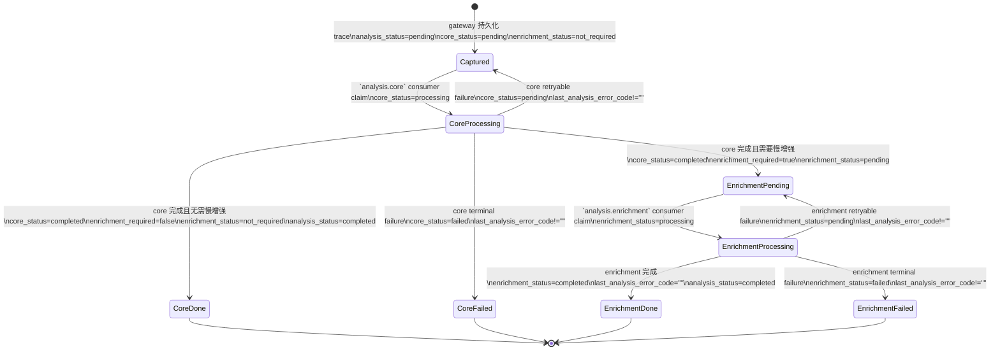

# ARCHITECTURE.md — 项目结构与模块说明

## 目录结构

```
new-api-gateway/
├── cmd/
│   └── audit-gateway/         # 程序入口，HTTP 路由装配
├── internal/
│   ├── gateway/               # 核心反向代理引擎
│   ├── routes/                # 上游路由注册与匹配
│   ├── config/                # 环境变量加载与校验
│   ├── authkeys/              # API Key 提取（6 个来源）
│   ├── fingerprint/           # HMAC-SHA256 指纹
│   ├── identity/              # 身份解析链（Redis → PG → new-api DB）
│   ├── evidence/              # 证据存储（filesystem / OSS）
│   ├── traces/                # Trace 与证据记录持久化
│   ├── jobs/                  # Redis 任务发布
│   ├── admin/                 # 管理 API（RBAC + 会话认证）
│   ├── adminui/               # 嵌入式管理 Web UI
│   ├── alerts/                # 覆盖告警（未知路由、原始优先路由）
│   ├── ops/                   # 健康检查、就绪探针、Prometheus 指标
│   ├── employee/              # 员工号规则
│   └── ids/                   # trace_ 前缀 ID 生成器
├── workers/
│   └── analysis_worker/       # Python 分析 Worker
├── migrations/                # PostgreSQL schema 迁移（按编号顺序）
├── scripts/run_migrations.sh  # Docker/运维迁移执行器，维护 schema_migrations
├── deploy/                    # Docker Compose 部署配置
│   ├── Dockerfile             # Go 网关多阶段构建
│   ├── docker-compose.yml     # 生产 compose
│   └── docker-compose.arm.yml # ARM Mac override
├── scripts/                   # smoke 与 e2e 检查脚本
├── docs/                      # 开发文档
├── Makefile                   # 常用构建目标
├── go.mod / go.sum            # Go 模块定义
└── .env.example               # 环境变量模板
```

## Go 模块详解

### `cmd/audit-gateway/` — 程序入口

`main.go` 负责组装整个 HTTP 处理链：

1. 从环境变量加载配置
2. 创建 PostgreSQL 连接池（网关 DB + new-api DB）
3. 创建 Redis 客户端
4. 按优先级装配路由：`/healthz`, `/readyz`, `/metrics` → `/admin/api/*` → `/admin/*` → 其他全部走网关代理
5. 启动 HTTP 服务，支持优雅关闭

### `internal/gateway/` — 核心代理引擎

系统核心，`proxy.go` 中 `Handler.ServeHTTP` 实现完整的请求生命周期：

| 文件 | 职责 |
|------|------|
| `proxy.go` | 主处理器：路由匹配 → 采集 → 身份解析 → 转发 → 采集响应 → 持久化 → 发布任务 |
| `capture.go` | 请求体读取，32MB 上限 |
| `headers.go` | 请求/响应头序列化为 JSON，脱敏敏感头 |
| `stream.go` | SSE 流式响应处理，并发写入客户端与证据存储 |
| `multipart.go` | multipart 请求解析，每个 part 单独存为证据 |
| `minimal.go` | 从请求/响应提取模型名称和 token 用量，记录 input/output/total 以及上游明确报告的 cached/reasoning token（支持 OpenAI/Anthropic/Gemini 格式） |
| `websocket_log.go` | WebSocket 双向日志（1MB 上限），正则脱敏 API Key |
| `spool.go` | 证据存储失败时的降级文件落盘 |

### `internal/routes/` — 路由注册

`DefaultRegistry()` 定义 30+ 已知 API 路由，每条路由指定：

- **协议族**（`openai`, `claude`, `gemini`, `realtime`, `midjourney` 等）
- **体类型**（`json`, `multipart`, `binary`, `websocket`）
- **采集模式**：
  - `raw_and_normalized` — 完整采集 + 归一化（chat/completions, embeddings 等）
  - `raw_and_minimal` — 完整采集 + 最小元数据（WebSocket, 视频生成等）
  - `raw_only` — 仅完整采集（当前未被使用）

支持精确匹配、段参数（`:model`）、通配符后缀（`*`）。

### `internal/authkeys/` — API Key 提取

从 6 个位置提取 API Key：

1. `Authorization: Bearer <key>`
2. `x-api-key` 头
3. `?key=` 查询参数（Gemini 风格）
4. `x-goog-api-key` 头
5. `mj-api-secret` 头（Midjourney）
6. `Sec-WebSocket-Protocol` 头（Realtime API）

规范化逻辑：去掉 `Bearer ` 前缀、`sk-` 前缀，截断到第一个 `-`，以匹配 new-api 的 token 解析。

### `internal/fingerprint/` — HMAC 指纹

使用 `AUDIT_HMAC_SECRET` 对规范化后的 API Key 计算 HMAC-SHA256：

- `Value` — hex 编码，用于内部存储和查找
- `Display` — `tkfp_` 前缀的 base32 编码，用于管理界面展示

### `internal/identity/` — 身份解析链

三级查找架构：

```
Redis 缓存 → PostgreSQL 缓存 → new-api 数据库直查
```

返回 `Snapshot` 包含：token ID、username、token 元数据、解析状态。

### `internal/evidence/` — 证据存储

`Store` 接口统一 Put/Get 语义，通过 `NewStore(StoreConfig)` 工厂函数按 `EVIDENCE_STORAGE_BACKEND` 选择后端。

| 后端 | object_ref 格式 | 实现 |
|------|----------------|------|
| `filesystem` | `file:///<relative-path>` | `FilesystemStore`：原子写入（临时文件 + rename） |
| `oss` | `oss://<bucket>/<object-key>` | `OSSStore`：阿里云 OSS SDK |

共性：写入时计算 SHA-256、路径穿越防护、Prometheus 指标 `evidence_store_ops_total`。

### `internal/traces/` — Trace 持久化

`Trace` 结构体包含 50+ 字段：trace ID、方法、路径、状态码、耗时、input/output/cached/reasoning/total token 用量、身份快照、模型信息、错误信息、所有证据引用。

### `internal/jobs/` — 任务发布

将最小 core envelope 写入 Redis `analysis.core` stream；Python worker 通过 consumer group 消费，并在需要时继续投递 `analysis.enrichment`。

### `internal/admin/` — 管理 API

12+ HTTP 端点，按 `/admin/api/` 路径注册：

| 端点 | 方法 | 权限 |
|------|------|------|
| `/login` | POST | 公开 |
| `/logout` | POST | 已认证 |
| `/me` | GET | 已认证 |
| `/me/password` | POST | 已认证 + CSRF |
| `/overview` | GET | `view_aggregates` |
| `/usage` | GET | `view_aggregates` |
| `/traces` | GET | `view_normalized_traces` |
| `/traces/{id}` | GET | `view_normalized_traces` |
| `/anomalies` | GET | `view_aggregates` |
| `/coverage-alerts` | GET | `view_aggregates` |
| `/api-key-lookup` | POST | `api_key_lookup` |
| `/context-catalog` | GET/POST | `view_aggregates` / `review` |
| `/review-decisions` | GET | `review` |
| `/token-identities` | GET | `view_aggregates` |
| `/settings` | GET | `manage_users` |
| `/audit-logs` | GET | `manage_users` |
| `/raw-evidence/{id}/{type}` | GET | `raw_access` 或 `admin` |

RBAC 角色：`viewer` → `auditor` → `raw_access` → `admin`，权限逐级递增。

异常菜单与 trace 详情返回的 anomaly 同时包含两套原因字段：`reason` 保留 worker 原始英文原因，`display_reason` 仅对当前支持的 anomaly type 生成中文展示文案；未知或历史类型会回退原始 `reason`，供前端列表和详情直接渲染。

安全特性：HMAC 签名 Cookie、CSRF 防护、频率限制、bcrypt 密码哈希、自助密码轮换、全量审计日志。

### `internal/alerts/` — 覆盖告警

- `unknown_route`（高严重性）— 未识别的路由（已废弃：未匹配路由现在返回 404，不再被代理和采集）
- `known_route_raw_first`（中严重性）— 已知但仅原始采集的路由

使用确定性 `alert_id`（基于关键字段 SHA-256），upsert 递增出现次数。

### `internal/ops/` — 运维健康

| 端点 | 用途 |
|------|------|
| `/healthz` | 存活探针（仅进程检查） |
| `/readyz` | 就绪探针（PG、Redis、证据存储、Worker 心跳、队列延迟） |
| `/metrics` | Prometheus 文本格式指标 |

指标包括：服务状态、运行时间、依赖健康、Worker 数量/心跳、队列深度、请求/失败计数、异常/告警数量。

## Go 与 Python 职责划分

项目由两个独立进程组成，通过 Redis Streams 协作：

| 维度 | Go 网关 (audit-gateway) | Python 分析 Worker (analysis_worker) |
|------|------------------------|--------------------------------------|
| 进程类型 | HTTP 长驻服务 | Redis 消费者长驻进程 |
| 数据方向 | 写入 `traces`、`raw_evidence_objects`、`token_identity_cache`、`coverage_alerts` | 写入 `normalized_messages`、`analysis_results`、`usage_aggregates`、`usage_anomalies`、`worker_heartbeats`、`raw_evidence_objects`（媒体资产）、更新 `traces.request_body_sha256` |
| 核心能力 | 反向代理、请求/响应采集、身份解析、管理 API + UI | 协议归一化、用量聚合、异常检测、工作相关性分类 |
| 通信方式 | XADD `analysis.core` | XREADGROUP / XAUTOCLAIM / XACK 消费 Redis Streams |
| 不启动的影响 | 整个系统不可用 | 代理转发正常，但分析、聚合、告警全部不可用，Redis 队列堆积 |

## Python 分析 Worker

位于 `workers/analysis_worker/`，使用 `uv` 管理依赖。

### 文件说明

| 文件 | 职责 |
|------|------|
| `main.py` | 入口：默认持续消费 `analysis.core` stream，也可通过 `--redis-list analysis.enrichment` 切到 enrichment；core 持续模式使用 `XREADGROUP COUNT N` + 本地线程池 + PostgreSQL 连接池批量消费；`--redis-once` 单次处理（测试用）；无环境变量时 stdin 合约验证 |
| `core_stage.py` | core 阶段处理器：从 trace/evidence 生成基础分析结果，只执行快速 heuristic，并在需要时投递 `analysis.enrichment` |
| `enrichment_stage.py` | enrichment 阶段处理器：承接慢增强任务，执行 LLM judge / 追加 enrichment 结果，收口第二阶段 trace 状态 |
| `models.py` | 数据类：`TraceCapturedJob`, `NormalizedMessage`, `AnalysisResult` 等 |
| `normalizers.py` | 协议归一化器：OpenAI chat/responses, Claude, Gemini；SSE 流重组 |
| `rules.py` | 持久化异常收敛层：统一计算 `effective_tokens = max(prompt_tokens - cached_tokens, 0) + completion_tokens`，当前 worker 新写入/收敛为 4 类 anomaly：`high_trace_tokens`、`long_output_anomaly`、`off_hours_high_usage`、`non_work_use` |
| `work_relevance.py` | 工作相关性分类器：基于 `context_catalog` aliases/keywords、non-work 规则和 token 成本分层生成 `WorkRelevanceAssessment`；必要时调用外部 OpenAI-compatible LLM judge，但只产出 `analysis_results` 语义，不直接落库 anomaly |
| `repository.py` | PostgreSQL 持久化：归一化消息、分析结果、`trace_usage_facts`、异常告警 |
| `evidence.py` | 证据存储抽象（`EvidenceStore` Protocol）与文件系统实现 |
| `oss_evidence.py` | OSS 证据存储实现（`OSSEvidenceStore`） |
| `media_extraction.py` | Base64 媒体提取：解码 data URL / raw base64，存储为独立二进制证据，替换 JSON 中的原始字符串为 `audit-media:` 引用 |
| `heartbeat.py` | Worker 心跳写入 |
| `media_snapshot.py` | SSRF 安全的媒体 URL 验证与下载 |
| `context_repository.py` | 从 PostgreSQL 加载上下文目录 |

### 处理管线

```
Core: Redis Streams (`XREADGROUP COUNT N` / `XAUTOCLAIM`) → 批量 claim → 线程池并发读取证据 → 协议归一化 + 快速 heuristic → 异常检测 → 写入 `trace_usage_facts` / `stage=core` 分析结果 → 需要时投递 `analysis.enrichment` → 心跳 / runtime sample → `XACK`

Enrichment: Redis Streams (`analysis.enrichment`) → 读取 trace / evidence → LLM judge 与慢增强 → 追加 `stage=enrichment` 结果与摘要状态 → `XACK`
```

### Trace 状态机



状态语义：
- `analysis_status` 表示整条 trace 是否已有完整分析结果。当前实现里，core 写完基础结果时通常就会置为 `completed`；如果后续还有 enrichment，它表示“已有可展示分析结果”，而不是“慢增强一定已经完成”。
- `core_status` 只描述 `analysis.core` 阶段：`pending -> processing -> completed/failed`，retryable failure 会回到 `pending`。
- `enrichment_status` 只描述 `analysis.enrichment` 阶段：无慢增强需求时保持 `not_required`；有需求时走 `pending -> processing -> completed/failed`，retryable failure 会回到 `pending`。
- `last_analysis_error_code` 记录最近一次阶段失败原因；enrichment 成功收尾时会清空该字段。

默认启动即进入持续消费模式，收到 SIGTERM/SIGINT 时优雅退出。默认消费 `analysis.core`，如需单独跑慢增强阶段可通过 `--redis-list analysis.enrichment` 或环境变量 `ANALYSIS_REDIS_LIST=analysis.enrichment` 启动第二组 consumer。core worker 暴露 4 个吞吐/恢复配置：`ANALYSIS_CORE_READ_COUNT`、`ANALYSIS_CORE_MAX_INFLIGHT`、`ANALYSIS_CORE_LEASE_SECONDS`、`ANALYSIS_CORE_RETRY_LIMIT`。enrichment worker 也有独立调参项：`ANALYSIS_ENRICHMENT_READ_COUNT`、`ANALYSIS_ENRICHMENT_MAX_INFLIGHT`、`ANALYSIS_ENRICHMENT_LEASE_SECONDS`、`ANALYSIS_ENRICHMENT_RETRY_LIMIT`、`ANALYSIS_ENRICHMENT_LLM_MAX_CONCURRENCY`，其中 `LLM_MAX_CONCURRENCY` 会作为 enrichment 批量消费并发上限。`--redis-once` 仅处理一个任务后退出，用于 e2e 测试；如果本地同时运行了常驻 worker，worker 类 e2e 应切换到隔离的 `REDIS_URL`（例如不同 Redis DB），避免测试任务被后台消费者或其他 consumer group 成员抢占。

`usage_aggregates` 与 `baseline_cache` 不再由 core 热路径同步 upsert；worker 只写单 trace 的 `trace_usage_facts`，离线 batch 负责 rollup 聚合和 baseline 重建。管理后台新增 `分析运行` 视图，通过 Redis Streams + `analysis_runtime_samples` / `analysis_tasks` 查询实时队列与消费者状态。

工作相关性结果会完整写入 `analysis_results.result_json`。当前语义收敛为：
- 明确非工作相关：`recommended_action=alert_non_work`，并落库 `non_work_use`
- 工作/非工作冲突：`recommended_action=review_conflict`，只保留在 `analysis_results` / `needs_review`，不再写 `work_nonwork_conflict` anomaly
- unknown：`recommended_action=record_only`，仅保留分析结果，不再写 `unknown_high_cost` anomaly

Trace 列表支持固定 50 条/页的页码分页；列表中的 `needs_review` 只对应 `analysis_results` 里的 review 语义。trace 详情页会额外返回关联 anomaly 摘要，且每条 anomaly 同时带原始 `reason` 与 `display_reason`。其中 `display_reason` 仅对当前支持的类型生成中文文案，未知或历史类型回退原始 `reason`。

### 工作相关性识别 V2

Worker 使用 `context_catalog` 的 aliases/keywords、独立 non-work 规则和 token 成本分层生成 `WorkRelevanceAssessment`。当规则冲突、弱信号中高成本、或高成本无强工作证据时，可调用外部 OpenAI-compatible vLLM endpoint 作为 LLM judge。

LLM judge 只处理工作相关性 assessment，不直接生成 `AnomalyAlert`。异常落库仍由 `rules.py` 中的 `detect_anomalies()` 与 `detect_work_relevance_anomalies()` 统一完成：
- `detect_anomalies()` 负责 3 类成本/时段异常：`high_trace_tokens`、`long_output_anomaly`、`off_hours_high_usage`
- `detect_work_relevance_anomalies()` 只会把显式非工作相关收敛为 `non_work_use`
- 成本型 trace anomaly 全部使用 `effective_tokens = max(prompt_tokens - cached_tokens, 0) + completion_tokens` 口径，避免缓存命中 prompt token 抬高阈值判断

默认 Docker Compose 会透传 `LLM_JUDGE_*` 到 `analysis-worker` / `analysis-batch` 容器；容器部署时只需在 `--env-file` 指定的 env 文件中配置这些变量即可。

配置语义：
- 四个 `LLM_JUDGE_*` 都缺失时，worker 以纯规则模式运行，不报错。
- 任意 `LLM_JUDGE_*` 已配置但 `LLM_JUDGE_BASE_URL` / `LLM_JUDGE_MODEL` 不完整，或 `LLM_JUDGE_TIMEOUT_SECONDS` 非法时，worker 启动即 `SystemExit`。
- `LLM_JUDGE_API_KEY` 不是必填项；未配置时会按无鉴权模式请求外部服务。
- LLM 服务运行中不可用时，worker 会对相关 trace 记录 degraded metadata 并回退到保守规则，不会整体停止。

## 数据库 Schema

14 个迁移文件，按编号顺序应用：

| 迁移 | 新增内容 |
|------|---------|
| `0001` | 核心表：`traces`, `raw_evidence_objects`, `token_identity_cache`, `coverage_alerts` |
| `0002` | trace 元数据扩展：耗时、头引用、客户端哈希、模型/用量/错误字段 |
| `0003` | 分析表：`normalized_messages`, `analysis_results`, `usage_aggregates` |
| `0004` | Worker 表：`usage_anomalies`, `worker_heartbeats` |
| `0005` | 上下文目录：`context_catalog` |
| `0006` | 管理端：`audit_users`, `audit_sessions`, `audit_action_logs`, `review_decisions` |
| `0007` | 运维健康：heartbeat 就绪检查 |
| `0008` | 元数据对齐：trace 补充字段 |
| `0009` | 异常规则扩展 |
| `0010` | CSRF 安全：admin session token |
| `0011` | 媒体快照：`media_snapshot_jobs` |
| `0012` | 媒体快照唯一约束 |
| `0013` | object_ref scheme 前缀：现有 filesystem 引用加 `file:///` 前缀 |
| `0014` | 统计基线：`baseline_cache`、`model_artifacts`、pgvector 扩展、`context_catalog.embedding` 列 |

## Docker Compose 服务

| 服务 | 镜像 | 启动方式 | 用途 |
|------|------|---------|------|
| `audit-gateway` | 本地构建 Dockerfile | 默认启动 | Go 网关（反向代理、采集、trace 持久化） |
| `analysis-worker` | `uv:python3.11` | 默认启动 | Python 分析 Worker（Redis 消费） |
| `postgres` | `pgvector/pgvector:pg16` | 默认启动 | 网关 PostgreSQL（user: `audit`, db: `audit_gateway`，含 pgvector 扩展） |
| `redis` | `redis:7` | 默认启动 | 任务队列 + 身份缓存 |
| `migrate` | `postgres:16` | `--profile tools` | 执行 SQL 迁移 |
| `analysis-batch` | `uv:python3.11` | `--profile tools` | 定时离线批处理（每小时 cron） |

## 常用命令

```bash
# Docker Compose 部署
docker compose -f deploy/docker-compose.yml --env-file .env.local --profile tools run --rm migrate  # 执行迁移（首次）
docker compose -f deploy/docker-compose.yml --env-file .env.local up -d     # 启动核心服务

# 本地开发
make dev           # 启动整套本地 compose 栈（ARM Mac 自动叠加 override）
make test          # Go 单元测试
make run           # 启动网关
make tidy          # go mod tidy
make smoke         # smoke 测试

cd workers/analysis_worker
uv sync            # 安装 Python 依赖
uv run pytest -q   # Python 单元测试
uv run python main.py --redis-once  # 处理一个 core 任务
ANALYSIS_REDIS_LIST=analysis.enrichment uv run python main.py --redis-once  # 处理一个 enrichment 任务
```
